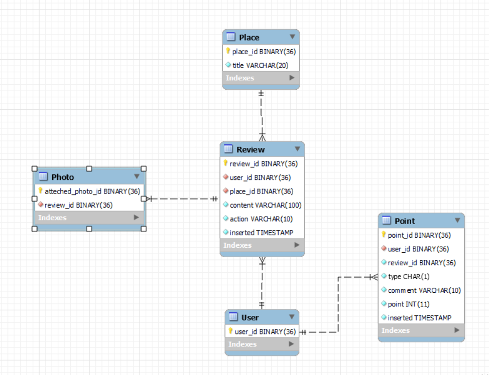

# 마일리지 적립 과제

## **기술 환경**
- JAVA 8
- Spring Boot 2.7.1
- MySQL(8.0.28)
- MyBatis

</br>

## **실행방법**

```
git clone https://github.com/qwer123sdas/Mileage_Homework.git
docker run --name mysql-container -e MYSQL_ROOT_PASSWORD=root -d -p 3306:3306 mysql:8.0.28
./mvnw spring-boot:run

애플리케이션은 port 8083으로 실행할 수 있습니다.
mysql 은 hostname은 127.0.0.1로, user_name은 root, password는 root 그리고 port는 3306으로 하시면 됩니다.
(임시 properties 파일을 참고하셔도 됩니다.)

POST / events : http://localhost:8083/events
GET / mileages : http://localhost:8083/mileages/{user_id}?page={pageNum}
```
```
※ 설치없이 빠르게 결과만 확인하기
아래의 경로로 테스트 케이스를 보내면 request에 따른 response만 빠르게 확인 할 수 있습니다.
POST / events : http://13.124.183.14/travel/events
GET / mileages : http://13.124.183.14/travel/mileages/{user_id}
```

## 테스트 케이스 id
```
user_id : 3ede0ef2-92b7-4817-a5f3-0c575361f745, 
          9ec1ff63-1783-4365-801e-8f09d1e6e1f1, 
          9ec1ff63-1783-4365-801e-8f09d1e6e1f2,
          9ec1ff63-1783-4365-801e-8f09d1e6e1f3,
          9ec1ff63-1783-4365-801e-8f09d1e6e1f4
place_id : 2e4baf1c-5acb-4efb-a1af-eddada31b00f, 
           7e234855-abee-449a-b632-dc6d366585c5,
           8f234855-abee-449a-b632-dc6d366585c5,
           9g234855-abee-449a-b632-dc6d366585c5
           
※ 테스트 케이스는 test-case 폴더에 있습니다.
```

---
   
## **ERD**



- 모든 id는 pk이고 다른 테이블의 id를 참조할 때, fk를 주어 정규화시켜주었습니다.
- pk는 자동적으로 유니크 인덱스를 생성하기 때문에, pk만 스캔하도록 하여 전체 테이블 스캔이 이루어지지 않도록 했습니다.

- fk에 create index를 하기 원한다면 한다면 아래의 sql을 사용하면 됩니다.
```
create index idx_user on Point (user_id);
create index idx_place on Point (place_id);
```
</br>


</br>

## **API**
### 포인트 적립요청
```
POST / events

Requset로 오는 데이터의 type에 따라 리뷰를 추가/수정/삭제하고 이를 처리된 데이터를 각각의 Reivew, Photo, Point 테이블에 저장합니다.

필요한 데이터가 없거나 리뷰 중복과 같이 검증이 필요한 경우, validator을 통해 runtime exception이 일어나게 하여 어떤 오류인지 
알 수 있도록 했습니다.(Response는 모두 ResponseEntity를 통해 처리했습니다.)
```
```
응답 샘플 : 

add review!
modify review!
delete review!

이미 작성한 리뷰가 있습니다.
등등...
```

</br>

### 마일리지 합계 및 조회 페이징
```
GET / mileages/{userId}?page={pageNum}

입력되는 유저 아이디에 맞게 작성된 리뷰 마일리지의 합산값과 리뷰를 추가/수정/삭제하며 변화된 마일리지 내역들을 보여줍니다.
type의 'A'는 Add의 앞글자,'D'는 Delete의 앞글자 입니다. comment는 어떠한 이유로 포인트가 증감했는지 간략하게 알려줍니다.
```
```
응답 샘플 : 

{
    "sum": 0,
    "logs": [
        {
            "pointId": "24dd3cca-77d1-49ff-b0ec-f7d6afa61f0b",
            "point": -3,
            "userId": "3ede0ef2-92b7-4817-a5f3-0c575361f745",
            "reviewId": "240a0658-dc5f-4878-9381-ebb7b2667772",
            "type": "A",
            "comment": "리뷰삭제",
            "inserted": "2022-07-10 16:14:26"
        },
        {
            "pointId": "54fe157b-16e3-4da9-873d-98847fe84c68",
            "point": 1,
            "userId": "3ede0ef2-92b7-4817-a5f3-0c575361f745",
            "reviewId": "240a0658-dc5f-4878-9381-ebb7b2667772",
            "type": "A",
            "comment": "사진추가",
            "inserted": "2022-07-10 16:14:01"
        },
        {
            "pointId": "b47225ee-67c8-4d4b-99d2-43e7d362cf50",
            "point": -1,
            "userId": "3ede0ef2-92b7-4817-a5f3-0c575361f745",
            "reviewId": "240a0658-dc5f-4878-9381-ebb7b2667772",
            "type": "A",
            "comment": "사진삭제",
            "inserted": "2022-07-10 16:13:46"
        },
        {
            "pointId": "7c217fd5-4ead-40c8-8cce-bfb0d642222a",
            "point": 1,
            "userId": "3ede0ef2-92b7-4817-a5f3-0c575361f745",
            "reviewId": "240a0658-dc5f-4878-9381-ebb7b2667772",
            "type": "A",
            "comment": "내용추가",
            "inserted": "2022-07-10 16:13:22"
        },
        {
            "pointId": "9f119ea5-35d4-43c9-b100-7e62d406c15b",
            "point": 1,
            "userId": "3ede0ef2-92b7-4817-a5f3-0c575361f745",
            "reviewId": "240a0658-dc5f-4878-9381-ebb7b2667772",
            "type": "A",
            "comment": "사진추가",
            "inserted": "2022-07-10 16:13:22"
        },
        {
            "pointId": "cfae6a21-1f8b-494c-be02-fff07a2eb22d",
            "point": 1,
            "userId": "3ede0ef2-92b7-4817-a5f3-0c575361f745",
            "reviewId": "240a0658-dc5f-4878-9381-ebb7b2667772",
            "type": "A",
            "comment": "첫리뷰",
            "inserted": "2022-07-10 16:13:22"
        }
    ]
}
```
